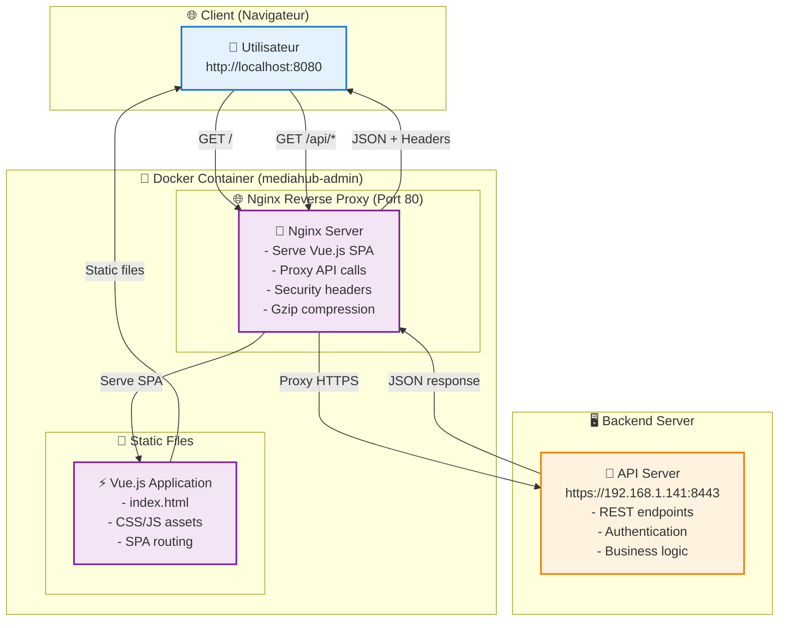

# 🚀 Simple MVC

A modern application based on MVC architecture with Vue 3, built with best practices and current technologies.

## 🛠 Technology Stack

- **Frontend:** Vue 3 (Composition API) + Vite
- **Styling:** Tailwind CSS + DaisyUI
- **Routing:** Vue Router 4
- **State Management:** Pinia
- **Build Tool:** Vite
- **Runtime:** Node.js 18.20+ (compatible with Vite 5.x) or 20.19+ (for Vite 7.x)

## 📁 Project Structure

```code

src/
├── components/          # Composants réutilisables
│   ├── ui/             # Composants d'interface
│   └── WizardModal.vue # Modal wizard
├── views/              # Pages/Vues principales (MVC Views)
│   ├── Dashboard.vue   # Tableau de bord
│   ├── Login.vue       # Page de connexion
│   └── Settings.vue    # Paramètres
├── stores/             # Stores Pinia (MVC Models)
│   ├── app.js          # Store application
│   └── user.js         # Store utilisateur
├── services/           # Services API (MVC Controllers)
│   └── api.js          # Client API REST
├── router/             # Configuration des routes
│   └── index.js        # Routes de l'application
├── App.vue             # Composant racine
├── main.js             # Point d'entrée
└── style.css           # Styles globaux
```

## 🎨 Functionalities

### ✅ User interface

- **Navigation responsive** with mobile menu
- **Theme System** (Light, Dark, Cupcake, etc.)
- **Interactive Dashboard** with statistics and quick actions
- **Connection Form** with validation
- **Parameters Page** complete (profile, appearance, notifications, security)

### ✅ Architecture MVC

- **Models:** Pinia Stores for Condition Management
- **Views:** Component Vuejs with Routing
- **Controllers:** API services for business logic

### ✅ Technologies Modernes

- **Vue 3 Composition API** for a better reactivity
- **Tailwind CSS** for utility-first styling
- **DaisyUI** for ready-to-use components
- **Vue Router** for SPA navigation
- **Pinia** for simple and effective state management

## 🚀 Quick Start

### Prerequisites

- **Option 1 (Docker):** Docker & Docker Compose
- **Option 2 (Local):** Node.js 18.20+ (minimum) or 20.19+ (recommended) + npm 8.0+

### Installation

#### Option 1: Docker Deployment (Recommended for Production) 🐳

```bash
# Clone the project
git clone https://github.com/sylvain94/simple_mvc.git
cd simple_mvc

# (Optional) Configure API backend URL
cp env.example .env
# Edit .env to set your API_BACKEND_URL

# Build and start with Docker Compose
sudo docker compose up -d

# Check logs
sudo docker compose logs -f

# Stop the application
sudo docker compose down
```

**Access the application:** 
- **Production (Docker):** [https://localhost](https://localhost) (HTTPS avec certificat auto-signé)
- **Development (npm):** [http://localhost:5173](http://localhost:5173)

**🔧 Configuration API Backend:**

```bash
# Option 1: Auto-detection (Recommended - Default)
# The application automatically detects the VM's IP address
# (where both frontend and backend applications are hosted)
sudo docker compose up -d

# Option 2: Use environment file for custom configuration
cp env.example .env
# Edit .env: set API_BACKEND_URL=auto or specify full URL
sudo docker compose --env-file .env up -d

# Option 3: Set environment variables directly
export API_BACKEND_URL=https://your-api-server.com:8443
sudo docker compose up -d

# Option 4: Auto-detection with custom protocol/port
export API_BACKEND_URL=auto
export API_BACKEND_PROTOCOL=http
export API_BACKEND_PORT=3000
sudo docker compose up -d
```

#### Option 2: Standard Installation (Node.js 18.20+)

```bash
# Clone the project
git clone https://github.com/sylvain94/simple_mvc.git
cd simple_mvc

# Install dependencies
npm install

# Launch the development server
npm run dev
```

#### Option 3: With Node.js Update (if you have Node.js < 18.20)

```bash
# Update Node.js to version 20.x (LTS)
curl -fsSL https://deb.nodesource.com/setup_20.x | sudo -E bash -
sudo apt-get install -y nodejs

# Verify versions
node --version  # Should be v20.x.x
npm --version   # Should be 10.x.x

# Clone and install
git clone https://github.com/sylvain94/simple_mvc.git
cd simple_mvc
npm install
npm run dev
```

#### Option 4: Using NVM (Node Version Manager)

```bash
# Install NVM if not already done
curl -o- https://raw.githubusercontent.com/nvm-sh/nvm/v0.40.1/install.sh | bash
source ~/.bashrc

# Install and use Node.js 20 (LTS)
nvm install 20
nvm use 20

# Clone and install
git clone https://github.com/sylvain94/simple_mvc.git
cd simple_mvc
npm install
npm run dev
```

### 🐧 Linux Server Installation (Headless)

If you're installing on a Linux server without GUI:

```bash
# Configure environment for headless server
export QT_QPA_PLATFORM=offscreen
echo 'export QT_QPA_PLATFORM=offscreen' >> ~/.bashrc

# Then follow standard installation
npm install
npm run dev
```

## 🐳 Docker Deployment

### Docker Compose Configuration

The application includes a complete Docker setup with:

- **Multi-stage build** for optimized image size
- **Nginx** as web server for production
- **API proxy** configuration for backend integration
- **Security headers** and compression enabled

### Docker Commands

```bash
# Build and start in detached mode
sudo docker compose up -d

# Build and start with logs
sudo docker compose up --build

# View logs
sudo docker compose logs -f simple-mvc

# Stop the application
sudo docker compose down

# Remove containers and images
sudo docker compose down --rmi all

# Rebuild from scratch
sudo docker compose build --no-cache
sudo docker compose up -d
```

### Docker Configuration

The `docker-compose.yml` includes:

- **Port mapping:** `80:80` et `443:443` (HTTP et HTTPS)
- **Network:** Isolated `mediahub-admin-network`
- **Restart policy:** `unless-stopped`
- **Environment variables:**
  - `NODE_ENV=production`
  - `API_BACKEND_URL=auto` (auto-detects VM's IP address)
  - `API_BACKEND_PROTOCOL=https` (for auto-detection)
  - `API_BACKEND_PORT=8443` (for auto-detection)
  - `API_SSL_VERIFY=off` (for self-signed certificates)
  - Timeout settings (30s by default)

### Nginx Configuration

The Dockerfile automatically configures Nginx with:

- **HTTPS/SSL** (certificat auto-signé, redirection HTTP→HTTPS)
- **SPA support** (Single Page Application routing)
- **Asset caching** (1 year for `/assets/`)
- **API proxy** to backend API
- **Security headers** (XSS, CSRF, HSTS protection)
- **Gzip compression** for better performance

### Architecture avec Reverse Proxy



## 📖 Available Scripts

```bash
# Development (HTTP sur port 5173)
npm run dev          # Serveur de développement Vite
npm run build        # Build de production
npm run preview      # Prévisualisation du build

# Production (HTTPS sur ports 80/443)
docker compose up -d           # Start with Docker (HTTPS)
docker compose logs -f         # See the logs
docker compose down           # Stop the application

# Development avec HTTPS (optionnel)
sudo npm run dev     # Nécessite sudo pour port 443
# Ou modifiez vite.config.js: https: true, port: 8443
```

## 🔧 Troubleshooting

### Common Issues and Solutions

#### ❌ "vite: not found" Error

```bash
# Solution: Install dependencies first
npm install
```

#### ❌ "Unsupported engine" or Node.js Version Error

```bash
# Check your Node.js version
node --version

# If < 18.20, update Node.js:
curl -fsSL https://deb.nodesource.com/setup_20.x | sudo -E bash -
sudo apt-get install -y nodejs

# Then reinstall dependencies
rm -rf node_modules package-lock.json
npm install
```

#### ❌ Qt/XCB Display Errors on Linux Servers

```bash
# Add environment variable for headless servers
export QT_QPA_PLATFORM=offscreen
echo 'export QT_QPA_PLATFORM=offscreen' >> ~/.bashrc
source ~/.bashrc
```

#### ❌ Permission Errors with npm

```bash
# Fix npm permissions
sudo chown -R $USER:$USER ~/.npm
# Or install with sudo and fix ownership
sudo npm install
sudo chown -R $USER:$USER node_modules
```

#### ❌ Docker Issues

```bash
# Permission denied for Docker
sudo usermod -aG docker $USER
# Then logout and login again

# Docker Compose not found
sudo apt update
sudo apt install docker-compose-plugin

# Port already in use (8080)
sudo docker compose down
# Or change port in docker-compose.yml: "8081:80"

# Build cache issues
sudo docker compose build --no-cache
sudo docker system prune -f

# Check container status
sudo docker compose ps
sudo docker compose logs simple-mvc
```

#### ❌ Package Lock Issues (Docker Build)

```bash
# If you get npm ci errors during Docker build
# The Dockerfile uses npm install instead of npm ci to handle version conflicts

# To fix locally and rebuild:
rm package-lock.json
npm install
sudo docker compose build --no-cache
```

#### ❌ HTTPS/SSL Issues

```bash
# Port 443 permission denied (Development)
# Solution: Use non-privileged port
# Edit vite.config.js: port: 5173 instead of 443

# Certificate warnings in browser
# Solution: Accept self-signed certificate or add exception
# The certificate is auto-generated and safe for development

# HTTPS redirect not working
# Check Nginx configuration in container:
sudo docker exec mediahub-admin nginx -t
sudo docker compose logs mediahub-admin
```

#### ✅ Verify Installation

```bash
# Local Development
node --version    # Should be >= 18.20
npm --version     # Should be >= 8.0
npx vite --version # Should show Vite version
npm run dev       # Should show: "VITE ready in XXX ms"

# Docker Deployment (HTTPS)
sudo docker compose ps                    # Should show "Up" status
curl -k https://localhost                 # Should return HTML (-k ignores SSL)
curl http://localhost                     # Should redirect to HTTPS
sudo docker compose logs mediahub-admin  # Check for errors
```

## 🎯 Available Pages

- **`/`** - Main dashboard with statistics and actions
- **`/login`** - Login page with validation
- **`/settings`** - Settings (profile, theme, notifications, security, instances)
- **`/files`** - File management with upload/download capabilities
- **`/srt-gateways`** - SRT Gateway management (incoming/outgoing streams)
- **`/selections`** - Selection functions with multicast input management
- **`/transcoding`** - Transcoding profiles and presets management
- **`/network`** - Network interface monitoring and configuration

## 🔧 Configuration

### DaisyUI Themes Available

- Light, Dark, Cupcake, Bumblebee, Emerald, Corporate, etc.

### Environment Variables

#### Frontend Development (.env)

Create a file `.env` for frontend development:

```env
VITE_API_BASE=http://localhost:8080/api/v1
VITE_APP_NAME=Simple MVC
VITE_APP_VERSION=1.0.0
```

#### Docker Deployment (env.example)

Copy and configure `env.example` for Docker deployment:

```bash
cp env.example .env
```

**Available variables:**

| Variable | Default | Description |
|----------|---------|-------------|
| `API_BACKEND_URL` | `auto` | Backend API server URL or "auto" to detect VM's IP |
| `API_BACKEND_PROTOCOL` | `https` | Protocol for auto-detected URL |
| `API_BACKEND_PORT` | `8443` | Port for auto-detected URL |
| `API_SSL_VERIFY` | `off` | SSL verification (on/off) |
| `API_CONNECT_TIMEOUT` | `30s` | Connection timeout |
| `API_SEND_TIMEOUT` | `30s` | Send timeout |
| `API_READ_TIMEOUT` | `30s` | Read timeout |
| `NODE_ENV` | `production` | Node.js environment |

**Examples for different environments:**

```bash
# Auto-detection (Recommended - Default)
API_BACKEND_URL=auto
API_BACKEND_PROTOCOL=https
API_BACKEND_PORT=8443

# Development with auto-detection
API_BACKEND_URL=auto
API_BACKEND_PROTOCOL=http
API_BACKEND_PORT=3000

# Staging with explicit URL
API_BACKEND_URL=https://staging-api.example.com:8443
API_SSL_VERIFY=on

# Production with explicit URL
API_BACKEND_URL=https://api.production.com:443
API_SSL_VERIFY=on
API_CONNECT_TIMEOUT=60s
```

## 🤝 Contribution

1. Fork the projet
2. Create a branch for your functionality (`git checkout -b feature/AmazingFeature`)
3. Commit yours changes (`git commit -m 'Add some AmazingFeature'`)
4. Push to your branch (`git push origin feature/AmazingFeature`)
5. Open a Pull Request

## 📝 License

This project is licensed under the MIT License - see file [LICENSE](LICENSE) for more details.
